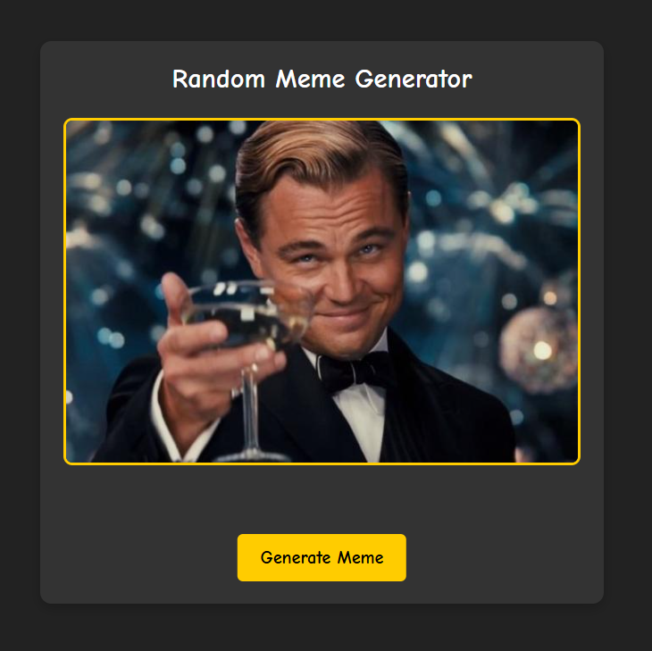

# 🎭 Random Meme Generator - HTML, CSS & JavaScript

A fun and simple meme generator built with HTML, CSS, and JavaScript. This project fetches random memes from the ImgFlip API and displays them dynamically.

## 📸 Meme Generator Preview



## ⚙️ Features

-  ✅ Fetches random memes from the ImgFlip API
-  ✅ Loading animation for a better user experience
-  ✅ Displays a default meme if the API is unavailable
-  ✅ Responsive design
-  ✅ Simple and easy-to-use interface

## 👨🏻‍💻 Technologies Used

-  HTML5 & CSS3
-  JavaScript (Fetch API)

## 🛠️ How It Works

Click the "Generate Meme" button to fetch a new random meme from the ImgFlip API. A loading message appears while the image is being retrieved.

## 🏁 Getting Started

Follow these steps to set up and run the meme generator on your local machine.

### 📋 Prerequisites

Make sure you have:

-  A modern web browser (Chrome, Firefox, Edge, Safari)
-  A text editor (VS Code, Sublime Text, etc.)

## 🚀 Installation & Usage

1️⃣ **Download or Clone the Project**

-  **Manual Download**:
   1. Click on the **Code** button at the top of the GitHub page.
   2. Select **Download ZIP** and extract the folder on your PC.
-  **Using Git (optional)**:

   ```bash
   git clone https://github.com/YannWoj/Random_Meme_Generator.git
   ```

   2️⃣ **Open the Project**

-  Open the folder in **VS Code** or any text editor.

   3️⃣ **Run the Meme Generator**

-  **Method 1**: Double-click on `index.html` to open it in your web browser.
-  **Method 2 (Live Server)**:
   1. Install the **Live Server** extension in VS Code.
   2. Right-click `index.html` > **"Open with Live Server"**.

## ✨ Have Fun Generating Memes!

Now you're all set! Click the button, enjoy and share your favorite memes. Have fun! 😃🎉
